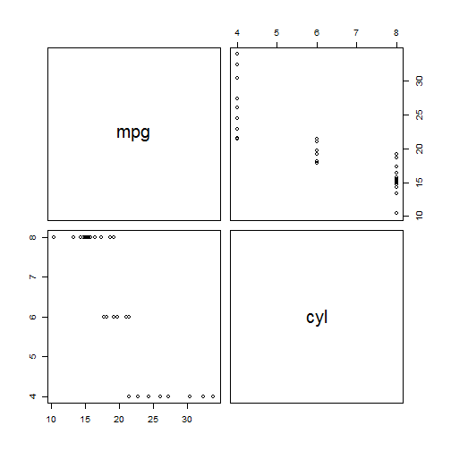
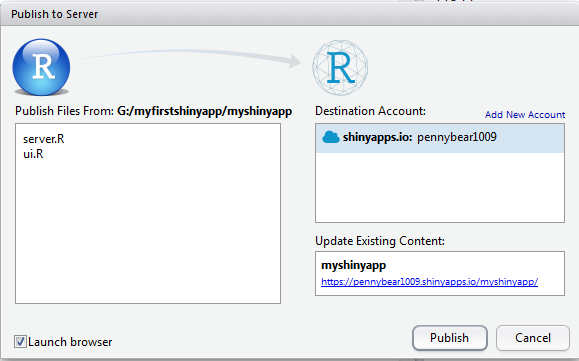

## Introduction to my app
This application can be used to explore mtcars dataset for the correlations of covariates. First, choose the covariates you are willing to explore, and then press the button. Here is it.


---
## Steps to create the app

* Design your user interface
 + Decide the layout
 + Choose the widget
* Programming to connect all the input and output parameters
* Deploy app on Rstudio's shiny server

---

## ui.R of my app
* __Layout__: `sidebarPanel` and `mainPanel` are used to arrange the UI
 + Sidebar: `checkboxGroupInput`and `submitButton` are added for feature selection
 + Main panel: `plotOutput` is added to print the plot, also other user documentations involved as an instrutction.
 
```
shinyUI(fluidPage(
  titlePanel(h1("Explore Dataset by Scatterplot Matrices")),
  sidebarLayout(position="right",
    sidebarPanel(
      checkboxGroupInput("feature","Choose your features:",
                choices = names(mtcars),selected = list("mpg","wt")),
      submitButton("See the plot",icon("fa fa-bar-chart"))),
    mainPanel(h3("Scatterplot Matrices"),
              h5("This application can produce a matrix of scatterplot with correlation coeffiencts of each pair of features"),
              plotOutput("scatterplotmatrix"),
              h6("referrence: R Graphic Cookbook by Winston Chang")))))
```

---

## server.R of my app
`pairs` is used to create the plot output, in the application I refer code from **R Graphic Cookbook** for some advanced presentation(*see github for details*). The origin code print the following plot:

```r
pairs(mtcars[,1:2])
```



---

## Deploy on shiny server
We use Rstudio to pubulish my application to shinyapps.io.



###Just show you how I create my application, thanks for watching!!


